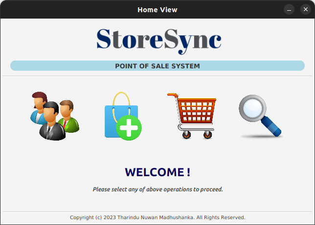
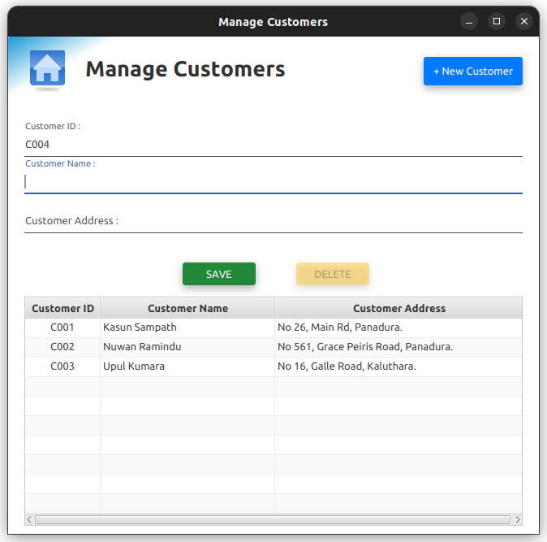
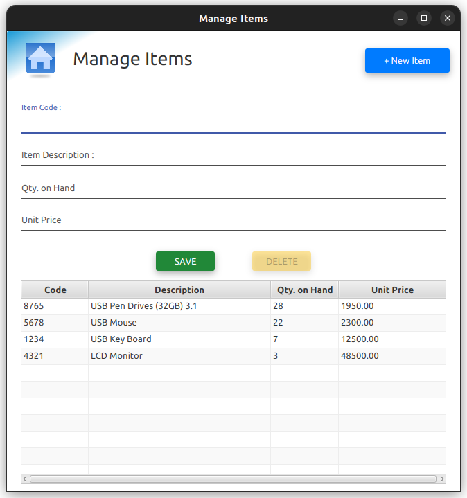
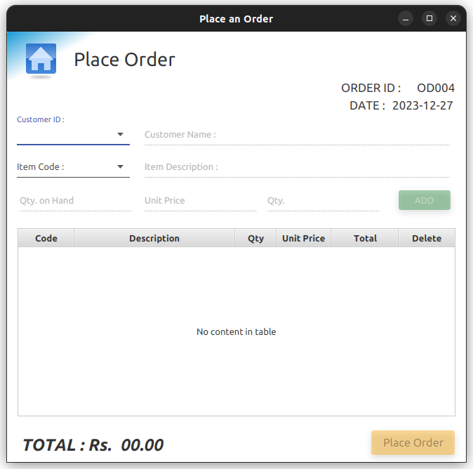
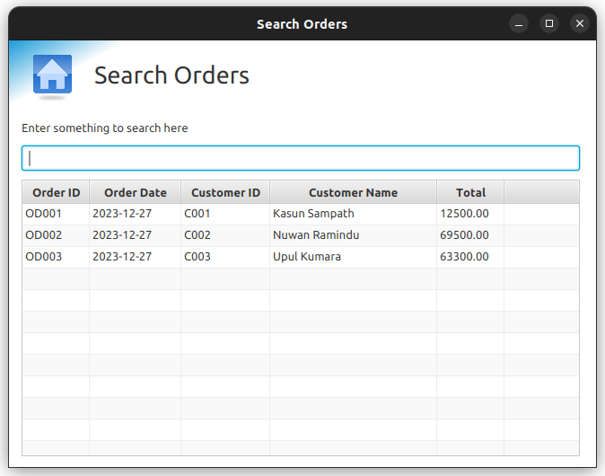

# StoreSync
### _Point Of Sales(POS) System_

---

Welcome to StoreSync, your all-in-one solution for efficient and seamless point-of-sale operations. StoreSync POS is designed to revolutionize the way you manage your retail or hospitality business, offering a wide range of features to enhance customer service, streamline transactions, and optimize inventory management.

### About StoreSync POS
At StoreSync, we understand the importance of delivering a superior shopping experience for your customers while empowering your business with the tools it needs to thrive. Our POS system is designed with these key principles in mind:

* **Simplicity:** StoreSync POS is user-friendly and easy to navigate, ensuring that your staff can quickly adapt to the system without extensive training.

* **Versatility:** Whether you run a small boutique, a bustling restaurant, or a multi-location retail chain, StoreSync is adaptable to your business type and size.

* **Efficiency:** With features such as inventory management, real-time sales tracking, and seamless payment processing, StoreSync streamlines your operations, saving you time and effort.

* **Insights:** Gain valuable insights into your business through in-depth sales reporting and analytics, helping you make informed decisions for growth.

* **Customization:** Tailor the system to your unique business needs, whether it's setting up tax rates, creating custom discounts, or managing loyalty programs.

---
### Key Features
* **User-Friendly Interface:** A simple and intuitive interface for cashiers and customers.  
* **Inventory Management:** Keep track of products, stock levels, and pricing.  
* **Sales Tracking:** Record and analyze sales data, including daily, weekly, and monthly reports.  
* **Payment Processing:** Supports for cash payment method. 
* **Receipt Generation:** Generate digital or paper receipts for customers.  

---

---
### Tech Stack Used
- **Languages** - Java, SQL, CSS
- **Framework** - JavaFX
- **Database** - PostgreSQL
- **Testing** - JUnit5
- **Other** - SceneBuilder, Jasper Reports

### Version
1.0.0

---

### License
Copyright &copy; 2023 Tharindu Nuwan Madhushanka. All Rights Reserved.
This project is licensed under [MIT LICENSE](License.txt).
